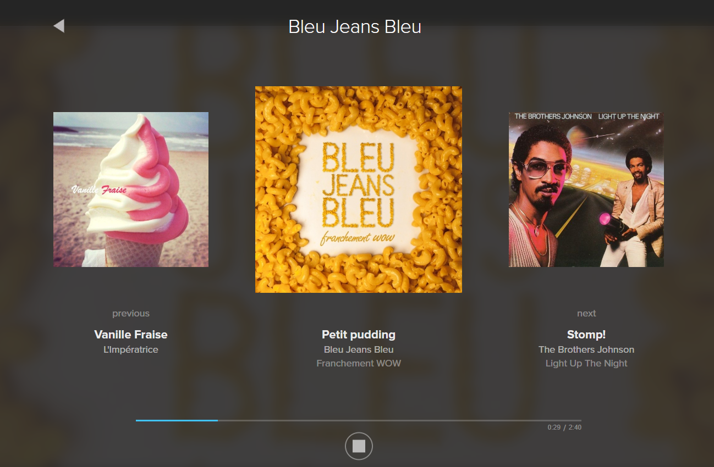
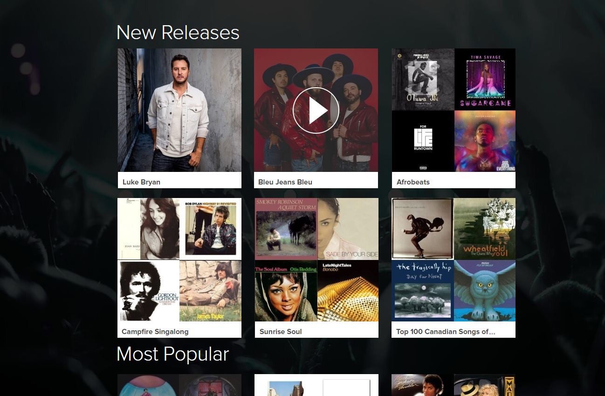

# Stingray Technical Test

Create a simple Stingray Music Application using the official Stingray Music API

## Requirement

* Populate the application content using the **Stingray Music API**.
* Display a home page with the different swimlanes (categories) and channels using the **swimlane endpoint**.
* Display a basic player with the current song playing.
* Continuously play the list of songs using the **playlist endpoint**.
* **Do not use any external libraries/components** with the exceptions of frameworks/core components (React, Angular, JQuery, Redux, etc). The goal is the assess your coding ability, not your integration skill. So using a library such as bootstrap or a widget like a carousel are not permitted.

### Optional

These requirements are there to further test your ability to code and are not mandatory. But doing some will increase your chance to succeed this test. This list is in no particular order.

* Language - React is the preferred language since it's what we use internally.
* Design - Follow the design to the best of your ability.
* Responsiveness - Support Mobile/Tablet/Web within the same app using the appropriate CSS.
* Animation - There are 2 main animations: when the covers changes, it should do a 'carousel' animation. When you click on the player, it should appear sliding from the bottom to the top.
* Session - When a new user loads your application, create a session with a unique GUID and use it as the device ID in the API. Also, you can save the last playing channel and resume it if we reload the page.
* Docker - Create a Dockerfile containing your whole project and ready to run.
* React/Redux/NodeJs/NextJs - If you are familiar with those technologies, you can use it to show your abilities.
* SCSS - Show your advanced css skills
* App Behavior - When navigating in the app, the music should continue in the background.

## Getting Started

Because of the security (CORS), we need to have a web server between the web application and the Music API. Since it can be time consuming creating a server,
we provide a simple NodeJS server. Here's the instruction on getting started. See API Section for more informaiton.

### Using Docker

In the root of the project, run the following command:

```Shell
docker-compose up
```

launch <http://localhost:3000/>

### Using NPM

In the root of the project, run the following commands using [NodeJS](https://nodejs.org/en/download/):

```Shell
npm install
npm start
```

launch <http://localhost:3000/>

## Design





We provide 2 mockups as visual guidelines but the hard requirements are defined in the next section. If it is too time consuming or you do not know how to do it, just display the data (content) in the best way you can.

### Pages

#### Home Page

The Home Page must be the initial page when the user load your application. So here's what we must have on the Home Page:

* List the different categories and their respective channels
  * Only support the swimlanes that are ``"type": "CHANNEL"``
  * Display at most 6 channels
  * Display each channel with its image and name.
* When you click on a channel, it must go to the **Player Page**.
* Add a mouse over effect when the mouse enters a channel button:
  * Add a play icon
  * Add an overlay

#### Player Page

The player will contain a media player in order to play the audio. We do not ask for any complicated player, but when a song ends, it should
automatically starts playing the next song. While doing that, the cover(s) should update accordingly. What we want to see on that page:

* The name of the channel
* The cover, song name and artsit of the current item playing playlist.
* A Play/Stop toggle button.
* A progress bar of the current song playing with the current time and total time.
* A back button to go back to the home page

### Player

Like explained in the Player Page, the behavior is simple: play songs one after another. Since we are making an application, it's important
that when a user is browsing the currently playing song is not interrupted.

## API

You can access the REST API using the following URI <https://music-api-service-prod.stingray.com/swagger-ui.html#/>
with this X-CLIENT-ID ``lklfdewur8943u98``.

The API is already well documented but to simplify the scope, here is the call you should consider while doing the application:

1. ``/music-api/v1/swimlane`` : List the different categories of channels (home page)
2. ``/music-api/v1/swimlane/{swimlaneId}`` : List the channels in a category (home page)
3. ``/music-api/v1/playlist`` : Create and update the playlist - Please use recommended size (player page)

### CORS

Since the API ``https://music-api-service-prod.stingray.com`` cannot be accessed directly in the Javascript because of 
the CORS (security). The local web server will redirect all the calls to it. Using the base path ``/music-api`` with the Stingray Music API,
the URL will become something like this: ``http://localhost:3000/music-api/v1/swimlane>``.

### Image Service

When using images URIs directly from the API, you will probably encounter an error when displaying the image.

```Shell
"cover": "https://image-service.stingray.com/music/2670909/ALBUM_COVER/%Wx%H/jpg",
```

You will see this pattern ``%Wx%H`` in the URI. You will have to replace the **%W** and the **%H** by an appropriate size.
A good size example would be ``300x300`` ou ``400x400`` since they are square.

### API Remarks

* A lot of extra fields in the response might appear, just ignore them if you do not need them.
* The song URLs are signed, so after a period of time, the link will become invalid (403 forbidden). Just don't hardcode the URL and you shouldn't have any problems.

## Comments

If you have problems, ideas, code you're not particularly fond of (or anything else), do not hesitate to leave comments.
Also, if you have comment about this test, do not be shy and give us your feedback.

## Review Process

When you will end your test, send it via e-mail.
After that, we will review your code and assess if we should go further in the interview process.
